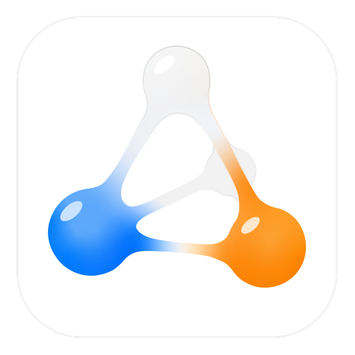

<p align="center">
  <a href="https://zatom.zauq.tech/">
    
  </a>
</p>

<h1 align="center">Zatom WebMCP Challenge Edition</h1>

<p align="center">Let people and AI agents work in the same scientific world.</p>

<p align="center">
  <a href="https://zatom.zauq.tech/">Website</a>
  ·
  <a href="README.md">English</a>
  ·
  <a href="README.zh-CN.md">简体中文</a>
  ·
  <a href="README.ja.md">日本語</a>
</p>

The goal is not to have an AI tell you in a chat window that “atom 184 is located at these coordinates.” It is to let you and the agent look at the same molecule, crystal, or surface and talk naturally:

> “This site?”  
> “No, the one on the right.”  
> “Point this hydrogen toward that oxygen.”  
> “Yes, just like that.”

Zatom asks a simple but fundamental question:

## Once an AI agent truly enters scientific modeling software, how should people and AI work together?

## Demo

Two minutes on why we are building Zatom.

<!-- Replace with the final demo video -->

[Watch the demo](YOUR_VIDEO_LINK)

<!--
Suggested demo image or video cover:

- A 3D molecule or crystal viewport
- An agent focusing on an adsorption site
- The target atom highlighted
- The user saying: "the one on the right"
- The agent adjusting the structure in real time
-->

## Why Zatom?

Language models have become increasingly capable of using software. They can call tools, write code, search for information, manage files, use APIs, and plan and carry out complex tasks.

Scientific modeling presents a special challenge, however.

### Scientists see a spatial world

An agent may receive something like this:

```text
Atom 181  O   3.214  7.812  12.391
Atom 182  H   3.841  8.120  12.904
Atom 183  H   2.771  8.492  11.944
...
```

A person will naturally say:

> “This atom.”  
> “The layer above it.”  
> “The site between those two atoms.”  
> “Rotate this molecule a little.”  
> “Why is the electron density so high here?”

For an agent that only has coordinates, identifiers, and a list of tools, “this one” can be harder to understand than a complicated formula.

Zatom is our attempt to build the missing scientific space between people and agents.

## What WebMCP makes possible

### 1. Model together

We do not want AI-assisted scientific modeling to become a one-way process:

> Prompt → automatically generate a complex structure → accept the result

Real scientific work is usually more iterative:

**Observe → try → adjust → compare → confirm**

An agent should be able to enter that process. It can understand the current molecule, crystal, surface, periodic system, selection, local environment, bonding, spatial relationships, and candidate sites. It can also focus, highlight, select, rotate the view, move the camera, mark candidates, transform structures, ask for confirmation, undo, and verify.

For example:

```text
User:
Help me place H₂O on this surface.

Agent:
This site?

User:
No. The one on the right.

Agent:
This one?

User:
Yes.
Point one hydrogen toward that oxygen.
```

The oxygen is highlighted. H₂O rotates around its anchor. The agent asks the user to confirm the result.

There is no need to look up atom IDs, enter XYZ coordinates by hand, or repeatedly copy data between a chat window and scientific software. Instead, the person and the agent share one context.

We call this **shared spatial attention**.

The agent should not merely operate the software. It should know what you are looking at—and show you what it is reasoning about.

### 2. Understand deeper

AI can make high-throughput model generation faster. But the more important question is not how many structures we can generate in a day. It is whether we can understand a structure, reaction, or mechanism sooner.

Alongside foundational modeling, we are continuing to develop visualization and analysis tools for scientific understanding, including:

- molecular orbitals
- electron density
- electrostatic potential
- partial charges
- scalar fields
- slice planes
- isosurfaces
- heatmaps
- local environments
- bond analysis
- distance, angle, and dihedral analysis
- periodic structures
- crystal surfaces
- adsorption structures
- defects and interfaces

The workflow should not end at:

```text
Structure generated
```

It should continue with:

```text
Why?
```

From **structure**, to **electronic structure**, to **mechanism**, an agent can help you look, compare, analyze, ask questions, and search for explanations—not simply draw a model.

### 3. Compute openly

We believe AGI can help make science and technology more accessible.

Computational chemistry, materials simulation, and scientific computing have traditionally involved complicated software stacks, expensive commercial tools, steep learning curves, fragmented workflows, repeated input and output conversion, and a great deal of low-level technical knowledge.

We hope to change that by helping build a more open loop for computational chemistry:

```text
Model
  ↓
Compute
  ↓
Analyze
  ↓
Visualize
  ↓
Understand
  ↓
Ask the next question
```

AI agents can connect scientific software, computational workflows, and domain knowledge that are currently separated. After creating a model, a user should be able to continue working with the agent to:

- prepare a calculation
- build its input files
- call open-source scientific computing tools
- submit and manage jobs
- retrieve results
- investigate failures or anomalies
- bring results back into the visualization environment
- analyze structures and electronic properties
- continue discussing reaction mechanisms
- revise the model in response to the results

Zatom is not intended to re-create every scientific computing package. We embrace the open-source scientific computing ecosystem and want Zatom to become a more natural way for people and agents to enter it.

Eventually, perhaps one agent and one scientific workspace could take you from an initial model to real computational results.

## Learn by modeling

Open scientific computing is only part of the idea. We also want science to feel more engaging and easier to understand.

AI should not only make experienced users faster. It should help people encountering organic chemistry, structural chemistry, computational chemistry, materials science, molecular modeling, or scientific computing for the first time understand what they are seeing.

While you build an organic molecule, an agent could explain:

- why a site is \(sp^2\)-hybridized
- why a bond cannot rotate freely
- what conjugation means
- how aromaticity affects electronic structure
- what R/S configuration means
- why some conformations are more stable

While you work with a crystal, it could explain primitive and conventional cells, Miller indices, periodic boundary conditions, coordination environments, crystal symmetry, surface cleavage, vacancies, defects, and interfaces.

While you build an adsorption system, it could discuss adsorption sites, surface coordination, orientation, charge redistribution, electronic interactions, and reaction mechanisms.

You should not have to finish a textbook before opening scientific software.

**Learn while you build. Understand while you compute. Build knowledge while you explore.**

We believe scientific education in the AI era may increasingly take this form.

## One more thing: what if an agent does not rely on screenshots?

Letting a multimodal model inspect screenshots of scientific software is one possible approach. We do not believe, however, that showing a model an RGB image is the endpoint of scientific spatial understanding.

Much of the information in scientific modeling is poorly suited to being reconstructed from pixels:

- periodicity
- bond topology
- atomic identity
- local coordination
- fragment identity
- periodic images
- surface normals
- selection state
- spatial relationships
- chemical state

We are therefore experimenting with converting a 3D scientific world into a structured observation that is better suited to language-model reasoning. Instead of this:

```text
Screenshot.png
```

the observation might look more like this:

```text
SYSTEM
  type: surface
  periodicity: [true, true, false]

SELECTION
  fragment: H2O
  anchor: O_184

LOCAL_ENVIRONMENT
  nearest_surface_atom: O_72
  relative_position: front-right
  coordination: ...

SURFACE
  normal: +Z
  candidate_site: bridge

PERIODIC_IMAGE
  translation: [0, 0, 0]
```

Such an observation could express topology, geometry, periodicity, chemical identity, local environment, spatial relationships, camera context, user selection, candidate regions, constraints, and previous actions. The agent could then work in a continuing loop:

```text
Observe
   ↓
Reason
   ↓
Act
   ↓
Observe again
   ↓
Verify
```

### Inspired by ARC-style reasoning

ARC-style reasoning tasks suggest that a visual problem can be transformed into a space an agent can observe, understand, reason about, and act within.

Scientific modeling is unusual because it is not a finite problem set. Every molecule can become a new problem. Every material can become a new environment. Every surface, defect, interface, adsorption structure, reaction, or question raised by a user can become a new reasoning problem.

We think of this as an **open-ended scientific reasoning environment**. The scientific world is itself an almost inexhaustible problem generator.

We do not yet know where this direction will lead. That uncertainty is part of what makes it exciting.

## Challenge Edition

This repository is the open version prepared for the WebMCP Challenge. It primarily explores:

- WebMCP scientific modeling tools
- molecular and crystal modeling
- human–agent collaboration
- spatial grounding
- shared spatial attention
- structured scientific observation
- scientific visualization
- open scientific computing workflows
- agent-assisted scientific reasoning

This is still a very early release. The full product remains under active development.

## This is only the beginning

The industry may not yet have a settled answer for what a genuine human–agent scientific interface should look like. Many questions remain:

- How much spatial information should an agent receive?
- Which information should be structured, and which should go to a vision model?
- How should periodic images and complicated local environments be represented?
- How should an agent interpret “this one,” “the nearby one,” or “the one on the right”?
- How should screen space and world space work together for grounding?
- When should an agent act directly, and when should it highlight a target and ask first?
- How can we verify that a modeling operation is scientifically correct?
- How should context be narrowed progressively for large systems?
- How can an agent focus on a relevant local region in a system with thousands of atoms?
- How do we connect structural understanding to real computation?
- After a tool call succeeds, how can an agent determine whether the scientific task itself succeeded?

These questions are an important reason for releasing the Challenge Edition. We hope it can be more than a demo: it can be the beginning of a conversation.

## Scientific modeling foundations

Zatom's current and upcoming versions are being developed to cover the following areas, among others.

### Molecular modeling

- atom and bond editing
- bond order
- molecular geometry
- fragment management
- charge
- stereochemistry
- structural manipulation

### Periodic and crystal modeling

- unit cells
- fractional and Cartesian coordinates
- periodic boundary conditions and periodic images
- supercells
- crystal structures
- surfaces and slabs
- vacuum regions
- defects
- interfaces

### Scientific visualization

- orbitals
- electron density
- electrostatic potential
- charge distribution
- slice planes
- isosurfaces
- heatmaps
- structural measurements

These capabilities are not only for people using the graphical interface. They can also become scientific infrastructure that agents can understand, invoke, and verify.

## Open scientific computing

In the future, we hope to connect more of the open scientific computing ecosystem, including:

- quantum chemistry
- electronic structure
- molecular and materials simulation
- machine-learning potentials
- structure optimization
- reaction exploration
- property calculation
- scientific analysis

Zatom should not become a closed computational island.

**Build the interface. Embrace the ecosystem.**

## Future learning experience

The future, extended version is planned to include more structured learning content.

### Organic chemistry

- molecular geometry
- hybridization
- resonance
- conjugation
- aromaticity
- stereochemistry
- functional groups
- reaction structures

### Structural chemistry

- molecular symmetry
- crystal structure
- coordination
- periodicity
- surface structure
- defects
- interfaces

### Scientific modeling

- how to build scientifically sound models
- how to understand periodic boundaries
- how to construct surface systems and adsorption structures
- how to prepare calculation inputs
- how to interpret computational results
- how to avoid common modeling mistakes

This content is not intended to follow a conventional “page, page, page, quiz” format. It should appear inside the real interaction: understand rotational freedom while rotating a bond, learn Miller indices while cutting a crystal plane, and connect an orbital to electronic structure while viewing it.

**Learning should happen inside the experience.**

## Steam and App Store

The full, extended version is under development and is planned for release on Steam and the App Store. It is expected to include more advanced modeling tools, scientific plugins, interactive tutorials, organic and structural chemistry learning content, computational workflows, scientific visualization, agent-assisted learning, and additional scientific reasoning tools.

We hope it can be both a genuine research tool and a welcoming first encounter with molecules, crystals, electronic structure, and computational science.

## Join us

Zatom is at a very early stage, which also makes this an interesting time to contribute. We welcome frontend and graphics engineers, WebGL and WebGPU developers, scientific computing developers, computational chemists, materials scientists, molecular modeling developers, UI and interaction designers, AI agent and MCP developers, open-source contributors, educators, and students.

You do not need to make a long-term commitment. An issue, a pull request, a scientific tool, a test structure, an agent interaction, a tutorial, or even a thoughtful “this design does not make sense” can improve the project.

If the intersection of AI, science, visualization, and education interests you, you are very welcome here.

## Open-source and commercial licensing

Zatom WebMCP Challenge Edition is planned to use the **GNU AGPL-3.0** license. We want researchers, developers, and the community to be able to study, modify, and extend this open version.

For organizations that want to integrate this project's technology into closed-source commercial products or services without adopting the AGPL model, we plan to offer separate commercial licensing.

The full commercial product, some official extensions, brand assets, logos, trademarks, and other materials not included in this repository are outside the open scope of the Challenge Edition.

For the exact scope, see:

```text
LICENSE
COMMERCIAL-LICENSE.md
TRADEMARKS.md
```

## For the community

We are continuing to develop plugins, scientific workflows, tutorials, learning content, and additional modeling tools for the full product. If the community believes in this direction, we hope to bring more of that work back to the community.

We want to explore together how agents should enter scientific software, how scientific software should enter the AI era, and whether scientific knowledge can be reshaped into a more natural, open, and engaging experience.

## Finally

Zatom began as a modeling tool. Then we connected it to agents. Along the way, we realized that the most interesting question may not be whether AI can model on a person's behalf.

It may be this:

## What happens when people and AI can truly share a scientific space for the first time?

We want to keep following that question. If the community sees promise in this direction, we will continue sharing more plugins, tutorials, workflows, and experimental capabilities.

And if you simply want the complete experience, we hope to see you soon on the App Store and Steam.

**Model together. Understand deeper. Compute openly.**

And perhaps build a better way for people and agents to do science together.
